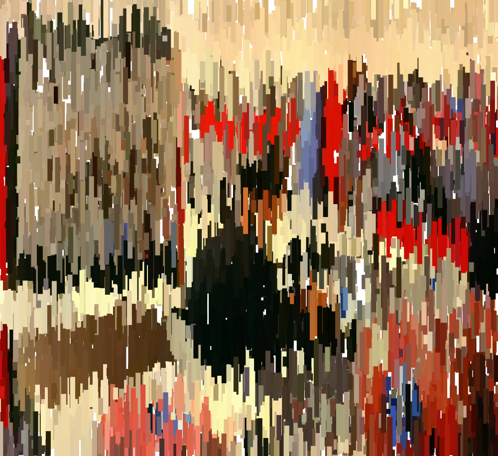

# Cours design interactif B1 Ynov Bordeaux
*du 28 mars au 30 mai 2024*

#### Sketches en ligne
✍️ https://editor.p5js.org/v3ga/collections/hjK0S1GZf

#### Google Sheets pour les rendus
✍️ [https://docs.google.com/spreadsheets/d/14U-QiGUbMP2MJb4XGEI7uMfeGapXhsIvKfrTAt0r4-s/](https://docs.google.com/spreadsheets/d/14U-QiGUbMP2MJb4XGEI7uMfeGapXhsIvKfrTAt0r4-s/edit?usp=sharing)

#### Visualisation de l'exécution d'un programme p5.js
:male_detective: https://v3ga.net/p5LearnableProgramming/index_U2_L2_lines.php 
C'est un projet expérimental pour montrer l'exécution pas à pas d'un programme sur quelques commandes de dessin. Utilisez la liste pour accéder aux différents exemples.

## Objectifs pédagogiques
* découverte de l'histoire de l'art génératif et plus largement du design génératif, évolutions des années 60 à nous jours.
* découverte de la programmation interactive temps réel, productions de visuels animés réagissant à des stimuli : mouvement(s), voix, ... 
* apprendre et maîtriser les concepts fondamentaux de la programmation : variables, boucles, branchements, fonctions. 
* apprendre à développer ses propres outils de création, création d'interface (UI) pour configurer et explorer les potentialités d'algorithmes de créations de formes graphiques.
* insérer ses productions de formes dans un workflow plus général : print, site web, installations interactives.

### Déroulé d'un cours  
Le cours sera consacré au deux tiers à l'étude théorique de concepts de programmation créative avec des références graphiques artistiques et l'autre tiers à la pratique par la réalisation d'un exercice « à chaud » utilisant les notions vues.

### Barême pour les exercices
Pour les exercices que je vous donne, le barême est le suivant (sur 10)
* **rendu en temps et en heure** :point_right: 1 point.
* **respect de la consigne** :point_right: 3 points. 
Le sketch doit être sauvegardé sur votre compte en ligne, l'addresse (URL) doit être insérée dans la colonne correspondante dans [le document Google Sheet](https://docs.google.com/spreadsheets/d/14U-QiGUbMP2MJb4XGEI7uMfeGapXhsIvKfrTAt0r4-s/). 
* **créativité** :point_right: 6 points. 
J'entends par créativité une recherche graphique personelle et/ou interactive qui peut se faire à partir de sketches vus en classe ou de références que vous trouvez en ligne.

## Cours 01
*Jeudi 28 mars 2024*

### Introduction
* Présentation du travail de Julien Gachadoat.
* Présentation de l'environnement [Processing](http://www.processing.org) et de son « écosystème » (notamment [p5.js](https://p5js.org/))
* Présentation de l'environnement de développement et premières commandes de dessin dans l'éditeur en ligne [editor.p5js.org/](https://editor.p5js.org/) 

### Dessiner avec du code 
* repère de dessin, espace de dessin [p5js / createCanvas](https://p5js.org/reference/#/p5/createCanvas)
* dessin de formes géométriques : [point](https://processing.org/reference/point_.html), [line](https://p5js.org/reference/#/p5/line), [ellipse](https://p5js.org/reference/#/p5/ellipse), [rect](https://p5js.org/reference/#/p5/rect).
* dessin de formes géométriques « composées » : [beginShape](https://p5js.org/reference/#/p5/beginShape) / [vertex](https://p5js.org/reference/#/p5/vertex) / [endShape](https://p5js.org/reference/#/p5/endShape)
* gestion des couleurs ([color](https://p5js.org/reference/#/p5/color)) et des options de dessin([stroke](https://p5js.org/reference/#/p5/stroke), [noStroke](https://p5js.org/reference/#/p5/noStroke), [fill](https://p5js.org/reference/#/p5/fill), [noFill](https://p5js.org/reference/#/p5/noFill), [strokeWeight](https://p5js.org/reference/#/p5/strokeWeight))
* exporter / faire une capture d'écran avec la fonction [p5js / save](https://p5js.org/reference/#/p5/save)

### Références
* [A Modern Prometheus — The history of Processing by C.Reas & B.Fry](https://medium.com/processing-foundation/a-modern-prometheus-59aed94abe85)
* [Welcome to Processing](https://vimeo.com/140600280), vidéo en anglais par [Dan Shiffman](http://shiffman.net/) pour [la fondation Processing](https://processingfoundation.org/).
* [Design by Numbers](https://dbn.media.mit.edu/) de [John Maeda](https://maedastudio.com/)
* [Ben Fry](https://www.benfry.com/) and [Casey Reas](http://reas.com/)
* [Rune Madsen / Computational color](http://printingcode.runemadsen.com/lecture-color/)
* [Daniel Shiffman / The Coding Train](https://www.youtube.com/channel/UCvjgXvBlbQiydffZU7m1_aw)

#### Exercice
Choisir une des œuvres [« Homages to the square »](https://www.google.fr/search?q=Josef+albers+square&sxsrf=AJOqlzXDonDyiy1zWyFfiJG2-z_exlfBGA:1677769320061&source=lnms&tbm=isch&sa=X&ved=2ahUKEwj0_tjiwb39AhWwVaQEHe5MD3wQ_AUoAXoECAEQAw&biw=1298&bih=898&dpr=1) de Josef Albers pour le récréer avec du code.

## Cours 02
*Jeudi 11 avril 2024*

### Dessiner avec du code (bis)
* retour sur les notions vus au cours 01 avec le dessin d'un visage de Bruno Munari. Nous introduirons à ce sujet la notion de **variable** que nous reverrons dans le cours 03.

Bruno Munari est un artiste plasticien italien. Peintre, sculpteur, dessinateur, designer, il est également auteur et illustrateur de livres pour enfants (source : [wikipedia](https://fr.wikipedia.org/wiki/Bruno_Munari))

### Animer
* Animer : 
  * avec une fonction génératrice de nombre aléatoires : [random](https://p5js.org/reference/#/p5/random)  
  * avec la variable de temps [frameCount](https://p5js.org/reference/#/p5/frameCount) et la fonction [millis()](https://p5js.org/reference/#/p5/millis)
  * avec les variables [mouseX](https://p5js.org/reference/#/p5/mouseX) et [mouseY](https://p5js.org/reference/#/p5/mouseY) pour capter la position de la souris dans le canvas.

#### Exercice à rendre pour le jeudi 18 avril 2024
Créez un visage dans le style de Bruno Munari en utilisant des formes géométriques.
Ajouter un élément d’interactivité en utilisant [la position de la souris](https://p5js.org/reference/#/p5/mouseX) ou la fonction [random](https://p5js.org/reference/#/p5/random). Le visage se dessinera sur un canvas de dimensions (500,500) pixels, les couleurs à utiliser sont le noir et le blanc uniquement.

##### Références
* [Page de créations sur Domestika](https://www.domestika.org/fr/courses/4034-initiation-au-code-creatif-generez-des-objets-graphiques/community/forum/topics/210634-creez-votre-propre-visage-dans-le-style-de-bruno-munari)

## Cours 03
*jeudi 18 avril 2024*

### Introduction à la notion de [variable](https://p5js.org/reference/#/p5/let)
* variables prédéfinies vues dans les cours précédents : mouseX / mouseY, width / height, frameCount.
* création / utilisation d'une variable dans un sketch simple. 
* Variable pour la gestion d'un media : 
  * Chargement et affichage d'une image, gestionnaire [preload()](https://p5js.org/reference/#/p5/preload)
  * Utiliser la fonction [imageMode()](https://p5js.org/reference/#/p5/imageMode) pour changer l'origine du dessin de l'image.
  * utilisation des informations de couleurs pour générer une composition : effet de « pointillisme ».

### Structure de branchement [if-else](https://p5js.org/reference/#/p5/if-else)
* exemple avec affichage d’un objet en fonction de la position de la souris.
* Modélisation d'un objet (bille), rebond sur les bords de l'écran.

#### Exercice à rendre pour le jeudi 25 avril 2024
Réaliser un collage d'images (au moins trois) qui représente un visage. Pour cela, vous utiliserez autant de variables représentant une image que nécessaire : 
* Les dimensions du sketch seront carrées (500 x 500). N'hésitez pas si nécessaire à découper les images avec une application avant de les intégrer.
* Vous implémenterez l'export d'une image à l'appui d'une touche sur le clavier, le nom de l'image devra être **Prénom_Nom.png**

Voici quelques exemples réalisés par la promo [2019-2020 des L2 Arts / Design](https://licence.designbordeaux.fr/LAG4U6/2019-2020/) à l'Université Bordeaux Montaigne.

Quelques exemples pour l'inspiration : 
 * [Les collages de John Stezaker](http://www.laboiteverte.fr/les-collages-de-john-stezaker/)
 * [Collages / Visages sur Pinterest](https://www.pinterest.fr/pin/296111744258061281/)
 * [Jean Faucheur / Inquiétude](https://www.jeanfaucheur.net/photographies/2016/1/6/inquitude)

## Cours 04
*mardi 14 mai 2024*

### Révision de la structure [if-else](https://p5js.org/reference/#/p5/if-else)
* exemple de partition de l'espace et opérateurs logiques.

### Introduction à la notion de [boucle](https://p5js.org/reference/#/p5/for)
* répétition d’un élément graphique de façon « naïve ».
* utilisation d'une boucle pour réaliser le même sketch. 
* création d'une double boucles imbriquées : pavage de du canvas avec un motif, modulation de la taille des motifs en fonction de la souris et du temps.
* Utilisation de cette grille pour reprogrammer une œuvre de [Vera Molnar](http://www.veramolnar.com/) : [Quatre éléments ditribués au hasard (1959)](https://www.centrepompidou.fr/fr/ressources/oeuvre/cez6op)

 

* Exemple d'éxécution pas à pas d'une boucle for : https://v3ga.net/p5LearnableProgramming/index_U2_L2_loop.php

### Export au format vectoriel 
Nous allons apprendre à exporter au format vectoriel [SVG](https://fr.wikipedia.org/wiki/Scalable_Vector_Graphics). L'environnement p5js ne gère pas nativement ce format, aussi nous allons importer une librairie externe qui va venir étendre ses fonctionnalités. Nous partirons du sketch suivant : https://editor.p5js.org/v3ga/sketches/uKzTvbgQ8

 
#### Références 
* [Grilles de truchet (images)](https://www.qwant.com/?client=brz-brave&t=images&q=truchet+grille&o=0%3AC9C8648332497AA6B9189484BAF8D6733465D4F4)
* [Jean-Noël Lafargue - L'improvisateur de tissus (1871)](https://hyperbate.fr/dernier/?p=42335) *Le 28 juillet 1871, face à l’Académie d’Amiens, l’ingénieur textile Édouard Gand a présenté ses travaux sur ce que l’on peut considérer comme un des tout premiers exemples — sinon le premier exemple véritable — de design génératif mécanique.*
* [Guillaume Pelletier-Auger - Les pavages de Truchet](https://pelletierauger.com/fr/projets/les-pavages-de-truchet.html) *Errances dans les mathématiques françaises du XVIIIe siècle.*
* [Anna Carreras — Trossets](https://www.artblocks.io/legacy/collections/curated/projects/0xa7d8d9ef8d8ce8992df33d8b8cf4aebabd5bd270/147)
* [Julien Gachadoat — Radiance](https://www.artblocks.io/legacy/collections/presents/projects/0xa7d8d9ef8d8ce8992df33d8b8cf4aebabd5bd270/106)

#### Exercice à rendre pour le jeudi 30 mai 2024
Fabriquer une grille sur le modèle des « Quatre éléments distribués au hasard » de Vera Molnar en utilisant un des deux templates suivants : 

* [template avec quatre éléments ](https://editor.p5js.org/v3ga/sketches/iKK2NoZqV)
* [template avec deux éléments ](https://editor.p5js.org/v3ga/sketches/9X9Fk8KI0)
  
Les contraintes sont de n'utiliser que des contours et pas de formes pleines (*noFill()*) dans l'optique d'imprimer ces motifs à l'aide d'un traceur [AxiDraw](https://www.axidraw.com/).
Je porterai le traceur pour faire une démonstration au cours du jeudi 23 mai.

## Cours 05
**mardi 21 mai 2024**

Dans ce cours nous allons aborder deux choses : 
* les **tableaux**, type de variable spéciale qui permet d'associer à une variable un ensemble de données, pratique pour gérer plusieurs objets simultanément. Nous appliquerons ce concept à la création d'un système de particules, en nous basant sur [la modélisation de "bille" (ou particule)](https://editor.p5js.org/v3ga/sketches/nRfjMA4aM) que nous avons vue au cours #03. Nous passerons de la gestion d'une particule à [n] particules. L'écriture et la lecture d'un tableau va se faire à travers une boucle for, notion vue au cours #0'.
* nous apprendrons aussi à relier une variable à un élément d'interface graphique (UI = user interface) pour explorer plus facilement les potentialités de notre algorithme en modifiant la valeur de variables grâce à des [sliders](https://p5js.org/reference/#/p5/createSlider) ou en déclanchant des actions avec des [boutons](https://p5js.org/reference/#/p5/createButton)

#### Références
* [Répartition de points — technique Poisson Disc sampling](https://www.jasondavies.com/poisson-disc/)
* [Répartition de points — technique de Stippling](https://observablehq.com/@fil/linde-buzo-gray-stippling)
* [Sketch "deux élements au hasard" (format vectoriel SVG)](https://editor.p5js.org/v3ga/sketches/gKNCj0Gkt)

